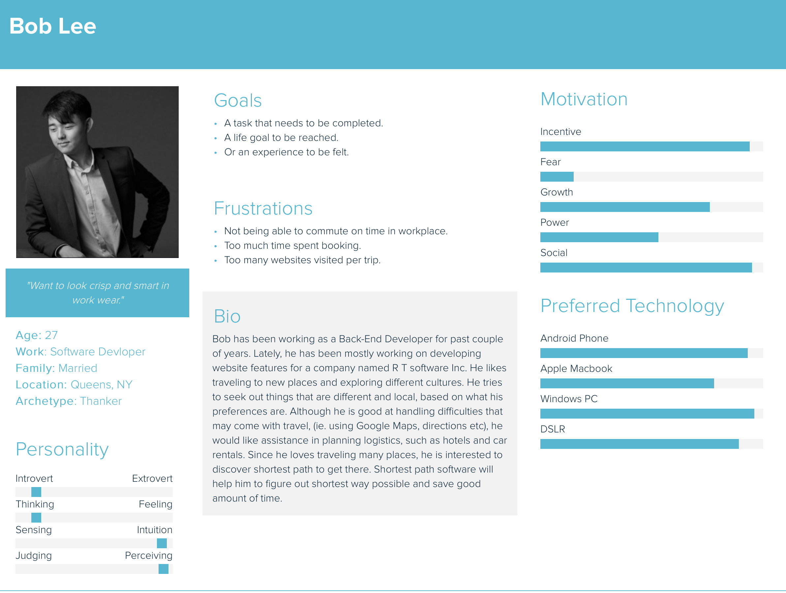

# 04- Final Project: ShortestPath
This project will create a program which will ask the user to enter two states in USA and it will find the shortest path to get there. The idea of doing this project is by creating a graph of cities in the Unites States with link to the other cities. Each city wil be used as a vertex in the graph and each link between cities will be an edge in the graph. The cities with their corresponding parameters will be read from a CSV data file.

# [Trello](https://trello.com/b/ERU7ukHz/04-shortestpath)

# Project Overview
This project is a good choice in getting familiar how the google map, maps or other programs make it possible to find the fastest way to get to the required destination. Also more practice using JAVA. The output of this project should be something like: It will ask the user to put the name of a city, which will be the starting point, and then it will ask the name of second city which will be the destination.

# Vision statement
This project is going to be useful for any person who travels short or long distances and wants to find the shortest and quickest way to get to it. It could be used by any customer at age 12 or older. The ShortestPath is a software which allows the user to input their starting point and their destination and it will calculate which direction the user will have to go to arrive at his destination as soon as possible. Unlike other maps software, our software only finds the shortest path between two cities at a moment.   

# Personas (Team of 5)
>>> Francesko Racaku Persona
-	Joan, a software developer team manager.
Joan, age 27, is a software developer in New York. He manages and organizes team members starting from age of 18. He was born in the beautiful country of Albania, where his father works as an advocate and his mother as a helper to his dad and notary. He moved in USA when he was 19 years old. As soon as he got in USA, he focused in school and he got his degree in computer science. Not long after he got his degree, he found the job at Colgate company as a software developer. To get at his job, he travels for a long distance every day, to go to work and come back home. 
- Joan’s experience as a software developer has made him to be confident and more efficient in programming using Python language. He believes that it is important for him to be at work in time and a software like ShortestPath can solve this issue to find the shortest way to arrive at his destination. He is interested in using ShortestPath software where he can definitely find his shortest way to get at his destination, especially his work.

>>> Xhuljano Racaku
- Chris, a talented cooker in Philadelphia, was born in Tampa, Florida. He has a high school diploma and quit college the first year, and he focused on what he knows to do the best, cooking. Chris moved to Philadelphia in his aunt house where he completed a culinary apprenticeship, and during the job training he worked hard to get as much as possible. His hobbies are soccer and traveling. Now, Chris is 36 years old and, he is a chef in Las Margaritas restaurant.
- Chris never leaves home without his smartphone.His parents live in Tampa, and he visits them couple times in a year. Also, his favorite place to visit is Miami which he usually goes in summer. This software will help him find the shortest path to follow from Philadelphia to any cities he chooses to go.

>>> Andreas G
- Ella, age 21, a junior statistics major at a private university in New York City. Born and raised in New Jersey, her mother is a chemistry professor and father a commercial pilot for a major airliner. Inspired at a young age by her parents to pursue a field in mathematics, she was twice captain of her highschool's mathletes and student president during her senior year, allowing her to get into a great school 
with a healthy scholarship. Her day-day involves going to classes, studying, and tutoring math on the weekends at both the university and the local highschools. During her free time, she watches films and maintains a log of data for every film. After graduation, she plans on going to grad school, with plans of becoming a professor in the field of mathematics or statistics. 
- One of her classes is driven on generation and analysis of some data. Her current assignment provides her with general data for all airports and flights in USA from major cities. Pick a city that has more than one 
airport (ex. NYC, LA, Boston, etc...) and generate the earliest arrival time (have access to departure time) for all major cities starting from each airport in origin city, and analyze in some statistical way. This application 
will allow her to generate data she needs, without having to calculate the distance by hand, or writing her own program to do so. 
>>> Faris
- Jack is 38 years old and works as a truck driver at amazon. He was born in Allentown, Pennsylvania. He now lives in the great city of Philadelphia. He is happily married with two children. He is a devoted father who likes to work hard to get his family’s needs. 
- Jack, like many fathers is not a big fan of technology but his job as a truck driver needs a map guide.  His job a lot of the time involves driving to a different city. There are many different routes he could take to reach his destination and he likes using this app to find the fastest one. He chose this app because it is easy to use and it user friendly. 
>>> Tonmoy C

